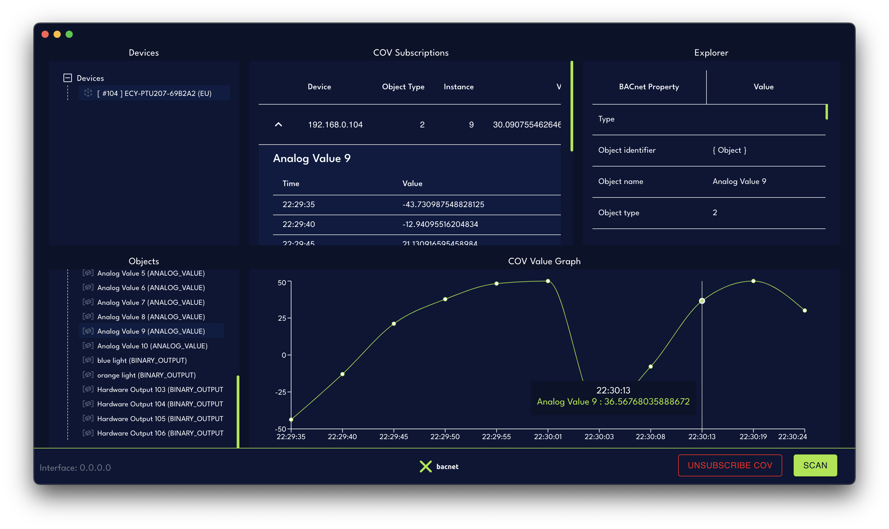

# XBacnet
The first ever cross-platform Bacnet explorer, for hobbyists and professionals alike.



## Running locally
If you want to run this application locally, few steps need to be taken.

1. First run ```npm install```
2. Then ```npm run react:start```
3. & After the 2nd command succeeded run ```npm run electron:start```

By default this will run react on **http://localhost:1234** and the electron app in development version

## Building from source

1. First run ```npm install```
2. Then a few options are available. If you want to build for linux, mac & windows run
    - ```npm run electron:build```
    - For Mac only: ```npm run electron:build-mac```
    - For Windows only: ```npm run electron:build-windows```
    - For Linux only: ```npm run electron:build-linux```


Website: [XBacnet](https://xbacnet.com)
